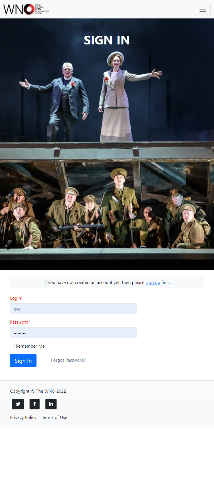
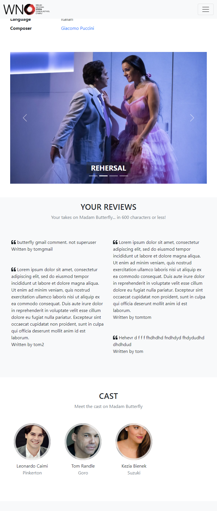

# Testing - Online production catalogue
## By Tom Naylor

**View live site:** https://tn83-wno-test-bed.herokuapp.com/

**View GitHub repo:** https://github.com/tomnaylor/ci-ms4-opera-rep

Welcome to the testing readme for the online production catalogue

## Table of contents
* [Testing](#testing)
  * [Unit tests in Django](#unit-tests-in-django)
  * [Automatic testers / validators](#automatic-testers-and-validators)
  * [Testing against the user Stories](#testing-against-the-user-stories)
  * [Manual Testing](#manual-testing)
  * [Known Bugs](#known-bugs)

## Testing

As well as the manual testing below I have also used the Chrome Dev Tools and PEP8 validators. I found them very helpful to notify me of any potential problems and code that violates the standard. I also used the googles lighthouse to test the site load times and user experience.

### Unit tests in Django

[TestCase](https://docs.djangoproject.com/en/4.0/topics/testing/overview/) is an automated testing class that I've used to program tests against the models, forms and views of the app. You can run tests on a forked version using "python3 manage.py test" in the bash shell. All tests are listed below along with a description of what they test against.

#### Profiles (/profiles)

Tests for profiles span three files: **test_forms.py**, **test_models.py** and **test_views.py** as there are a number of tests for this app.

##### test_forms.py

* ProductionCommentFormTest
    * **test_profile_comment_fields_are_required** tests that without a comment the form will be invalid
    * **test_profile_comment_fields_are_inc_in_form_metaclass** tests that comment is the only form element in meta fields

* ProfileFormTest
    * **test_user_login_success** tests is a valid user can log-in and get re-directed correctly
    * **test_profile_city_is_not_required** tests that the city field isn't required
    * **test_profile_country_is_required** tests that the country field is required
    * **test_profile_fields_are_inc_in_form_metaclass** tests that wanted fields are the only form element in meta fields

##### test_views.py

* ProductionViewTest
    * **test_profile_view** tests a logged-in user can view their profile page
    * **test_profile_view_no_user_view** tests that a logged-out user can't access the profile page and gets redirected
    * **test_profile_comment_edit_no_user_view** tests that a logged-out user can't edit a comment
    * **test_profile_comment_edit_view** tests that the logged-in author can view the edit page
    * **test_profile_comment_edit_other_user_fail_view** tests that a logged-in user can not edit the comment of another user
    * **test_profile_comment_del_no_user_view** tests that a logged-out user can not delete a comment
    * **test_profile_comment_del_view** test that the logged-in author can delete a comment
    * **test_profile_comment_del_other_user_fail_view** tests that a logged-in user can not delete the comment of another user
    * **test_profile_comment_add_no_user_view** tests that a logged-out user can not add a comment
    * **test_profile_comment_add_view** tests that a user can post a comment to a unique production

##### test_models.py

* ProductionCommentModelTest
    * **test_production_comment_model** tests the comment model
    * **test_production_likes_model** tests the likes model

#### Main app (/opera_rep)

Tests for the main app are all contained in the tests.py file and all test the settings

* SettingsTestCase
    * **test_login_url** tests that the login URL is set and correct
    * **test_redirect_url** tests that the login redirect URL is set and correct
    * **test_logout_redirect_url** tests that the logout redirect URL is set and correct

#### Home page (/home)

Tests for the home app are all contained in the tests.py file

* HomeViewTest
    * **test_home_response_success** tests that the home page is loading correctly

#### Donations (/donations)

Tests for the donations app are all contained in the tests.py file

* DonationTest
    * **test_new_donation_view** tests all users can view the new donation form
    * **test_empty_donation_model** tests creating a new empty donation model
    * **test_donation_model** tests creating a populated donation model
    * **test_donation_form_email_fail** tests that an invalid email address fails
    * **test_donation_form_name_fail** tests that an invalid name fails
    * **test_donation_form_country_fail** tests that an invalid country selection fails
    * **test_donation_form_city_fail** tests that an invalid city fails
    * **test_donation_form_is_valid** tests that a valid donation form saves
    * **test_profile_fields_are_inc_in_form_metaclass** tests that wanted fields are the only form element in meta fields

### Automatic testers and validators

#### PEP8 validator
All py files were checked on the PEP8 validator passed without error. The flake8 linter was also used in Gitpod.

#### Lighthouse
I used lighthouse on both the desktop and mobile versions of the site.

### Testing against the user Stories
#### As a first time user:

**Easily register and recover my password**

Django has an allauth intergration that makes user accounts easy and secure to manage. The site takes advantage of the 2-step verification process to make sure that the email address is valid. Logging in, out and changing passwords is easily done via the top menu and all sensitive data is help in the secure postgres DB

**Donate to the company**

I have used Stripe to bring card payments directly into the app. Every production and on various pages on the app has links to donate. Productions have three options, £5, £10 and £20. Once clicked, the user only needs to fill in a simple form (which is auto filled for logged in users), enter the car details and click "donate". If they are a logged in user, their donation will be linked to their account so they can keep track of donations. The donations will also feature on the production (if one has been selected) to show recent donations and a sum total. The Stripe intergration will also email the donator once the funds have been cleared.

**See this years productions**

Productions on the home page and productions page are ordered by date. They will also show the current productions and mark any dead shows with a clear message. 

**See who is in the cast or creatives for a production**

Every production has a number of fields to link to personal profiles. These are cast, creative, staff and composer. Each one will have their photos in the section and a link to their profile on the app. Inside their profile, you can also view all productions they have been part of, so you can track thru their history.

**Watch videos of the production or backstage**

Videos are currently taken from youTube and shown direct on the production page. In the future I hope to host the videos to put some behind a possible paywall.

**Like the productions I want to keep track of**
Every production can be liked by a logged in user. There is a box on the top of the production that turns this on and off. Also, on the profile page, there is a list of productions so you can quickly see which ones you've chosen.

**Browse photos from the live performance and backstage**

photos form a carasel on the productions page. This is responsive and shows more detail and the screen gets bigger.

**Leave a review about a production**

Every logged in user can post one review toward a production. From the production page, they can also delete their own review and click edit to be taken to another page to edit it directly.

#### As the site owner, I want to:
**build an online audience for my productions**

comments and likes mean the user may choose to create an account. This will then give accurate email addresses for marketing. Not putting good content behind a uwer account / payment will help build an audience that may at the start be just casual.

**receive secure donations using STRIPE**

Stripe payments have been added throughout the app, the payment page is quick and simple to drive more donations

**Make the app easy to navigate and mobile friendly**

The app was made in a "mobile first" way. That means it's well suited for the vast population that will visit the site.

### Manual Testing
I have preformed manual tests on a number of browsers and devices to cover most scenarios and feel assured the website works as intended for all visitors. This included using google dev tools to simulate different screen sizes and using a real android and apple phone and family to act as first time visitors. In total:

* The app was tested using Chrome, Edge and Safari browsers.
* In chrome dev tools, I made dimensions for all bootstrap breakpoints and tested each update on all 5
* The app was tested on a number of devices such as Desktop, Laptop, iPhone and android.
* The app was tested extensively to ensure all links, styles and events worked as expected

### Known Bugs

#### Resolved
* Edditing the __str__ return for objects failed when trying to concat strings. Non-string objects needed to be wrapped in str()

* Env variables would persist or not be avaliable even after "gp evn -e". Doing so also currupted ones that did work and while still reachable, would not work. I changed the scope in Gitpod to me more specific (user/project) rather than (user/*). I would also need to shut down the session and re-start Gitpod. Help from [here](https://able.bio/rhett/how-to-set-and-get-environment-variables-in-python--274rgt5), [here](https://www.gitpod.io/docs/environment-variables) and [here](https://blog.doppler.com/environment-variables-in-python)

* Users could add more that one review to each production. Even with making UI restrictions, the unit test would be able to save multiple reviews. A [stackoverflow](https://stackoverflow.com/questions/2201598/how-to-define-two-fields-unique-as-couple) article helped explain making two fields unique as one.

* Migrations from the test server (using sqllite) and the produciton Heroku server (using postgres) oftern failed. I starting using the production DB even for the dev server on Gitpod. Help from [here](https://hevodata.com/learn/sqlite-to-postgresql/), [here](https://simpleisbetterthancomplex.com/tutorial/2016/07/26/how-to-reset-migrations.html), [here](https://www.dev2qa.com/how-to-force-reset-django-models-migrations/) and [here](https://stackoverflow.com/questions/11337420/can-i-use-an-existing-user-as-django-admin-when-enabling-admin-for-the-first-tim) helped resolve the problem and articles [here](https://stackoverflow.com/questions/6148421/how-to-convert-a-postgres-database-to-sqlite), [here](https://devcenter.heroku.com/articles/heroku-postgres-import-export) and [here](https://stackoverflow.com/questions/17022571/how-can-i-download-db-from-heroku) showed me how to download the postgres DB to use as fixtures for the sqllite Gitpod DB.

* I couldn't get the search to work using a foreign key property. [This stackoverflow](https://stackoverflow.com/questions/1981524/django-filtering-on-foreign-key-properties) article explained how to use __ in the filter to represent the child object.

* Custom 404 and 500 pages would not work. Django has updated this method a few times and [this article](https://pytutorial.com/django-create-custom-404-page) helped with the v3 changes.

* getting a list of the most liked productions. I needed to count the total likes grouped by production and then get the objects that match the ids of the top 4. [this site](https://realpython.com/python-enumerate/), [this site](https://stackoverflow.com/questions/1185545/python-loop-counter-in-a-for-loop) and [this site](https://books.agiliq.com/projects/django-orm-cookbook/en/latest/duplicate.html) had a lot of useful information

#### Persistant

* Adding a review longer than the 600 char limit throws a 500 page and not a graceful error, or even an automatic crop of the text