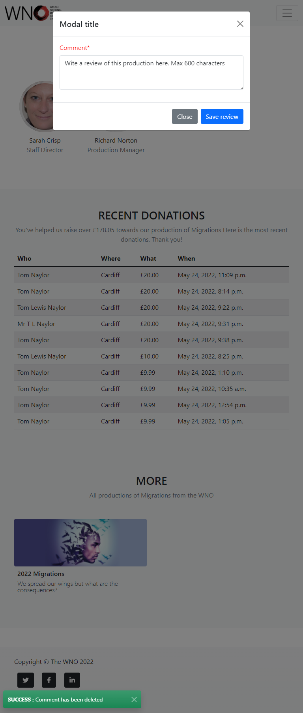

# Online production catalogue
## By Tom Naylor

**View live site:** https://tn83-wno-test-bed.herokuapp.com/

**View GitHub repo:** https://github.com/tomnaylor/ci-ms4-opera-rep

Welcome to the online production catalogue for the WNO. The web application aims to grwo the online audience of the Welsh National Opera thru info, photos, videos, cast members, user reviews and more. The site also accepts donations to help the company produce more work.

## Table of contents
* [UX](#ux)
  * [Target Audience](#target-audience)
  * [User Stories](#user-stories)
  * [Site Owners Goals](#site-owners-goals)
  * [Development Methods](#development-methods)
  * [Design](#design)
* [Features](#features)
  * [Existing Features](#existing-features)
  * [Features left to implement](#features-left-to-implement)
* [Technologies used](#technologies-used)
* [Testing](#testing)
* [Deployment](#deployment)
* [Credits](#credits)

## UX

### Target Audience
* Theatre / Opera lovers
* Opera students
* Art donators

### User Stories
#### As a site user, I want to:
* easily register ***so that I can*** have a personal account and save details
* easily recover my password ***so that I can*** recover access to my account
* donate to the company ***so that I can*** show my support to the WNO or one of it's productions
* see this years productions ***so that I can*** find out whats coming up in the near future
* see who is in the cast or creatives for a production ***so that I can*** follow my favourite performers or artists
* watch videos of the production or backstage ***so that I can*** watch related material and keep the production current
* like the productions I want to keep track of ***so that I can*** see updates to my favourite productions quickly
* browse photos from the live performance and backstage ***so that I can*** see the production from a new angle
* leave a review about a production ***so that I can*** interact with the community and express my views of the material

#### As a returning visitor, I want to:
* see the new items quickly on the home page ***so that I can*** get upto date quickly
* see updates from productions I've liked ***so that I can*** get relavant updates

#### As a future site user, I want to:
* read playtexts, show books, rehersal scrips and stage management bibles ***so that I can*** get an insite into the production process and how a show to rehersed **~TO DO**
* look thru old posters, tickets, programmes and brouchures related to the production ***so that I can*** get a broad idea what the theatre world was like at the time **~TO DO**
* stream videos of previous productions ***so that I can*** enjoy new shows or relive previous memories **~TO DO**
* watch interviews with cast, creatives, crew etc. ***so that I can*** find out more from people that are involved with the production **~TO DO**
* watch time-lapse builds of a production ***so that I can*** see what goes into constructing the sets **~TO DO**
* Lego / ikea like list of tools and parts and assembly instructions ***so that I can*** see what work goes into building the sets **~TO DO**

### Site Owners Goals
#### As the site owner, I want to:
* build an online audience for my productions
* receive secure donations using STRIPE
* make the app easy to navigate and mobile friendly
* create a single app for alll the production news and media
* review reviews before they go live **~TO DO**

### Development
 As the sole developer of the online production catalogue, I have taken an agile approach to the development of the app. I build an early release and then completed user stories as smaller incremental improvements. This method alows me to write the expectations of the sites users, order them, and tackle one at a time. This helps make sure the basic function of the app is running to ship to market as soon as possible.

### Design

#### Wireframes
I used a drawing tool to create a wireframe for the two responsive sizes (desktop and mobile).

#### Codebase
The frontend will be built using Bootstrap 5.1 for the layouts and styling. The backend will be developed in Python, using the Django framework. The site will consist of a number of apps that will individually handel the models, urls, forms and views for each:
* **home** to manage the homepage
* **works** to manage the productions, media, people
* **profiles** to manage the user profiles, comments and likes
* **donations** to manage the donations

#### Database
I used a postgres DB hosted by Heroku (on AWS) for the production database. I also used a local sqllite3 DB for development and tests. At it's basic function, the app uses a number of tables that mostly share keys so that duplication is avoided. An ERD image is below.

The database has tables across 4 apps: works, profiles, user and donations.

##### works
This app has 6 models, they all stem from the **works.Work** which is a table of operatic works ie. Madame Butterfly. It contains the name of the work, a url slug, composer and the world premier. The next table, **works.Production** is a list of productions of the same work, ie. the 2022 production of Butterfly and the older 2006 version. Each production contains all the cast, crew and creatives as well as the unique url slug, a hero image, thumbnail image and more. The **works.Role** links to the cast, creatives and staff to give a person a role on the production. The people can be used in many productions and their roles will often change (stage name or lighting director etc.).**works.ProductionPhoto** and **works.ProductionVideo** both link to the production ID and can add as many photos and videos to a production as needed.

##### profiles
This app extends the user.User allauth made table. The **profiles.UserProfile** adds some extra details to the user account such as city and country used in donations. **profiles.UserComment** holds the reviews for the productions, **profiles.UserLike** keeps which user likes what production.

##### donations
The **donations.Donation** table keeps a record of all donations made via Stripe. Its updated when the payment is success (either via the user session or the webhook).

#### Font family
To provide a readable, reliable and fast font library, I have used the "Segoe UI" font that bootstrap comes build with.

#### Colours
I used the build in [colours in bootstrap](https://getbootstrap.com/docs/5.1/customize/color/), taking advantage of the built in styles. Mostly using blues, greens and light greys.

#### Icons
All icons used are from the [fontawesome v5.15.4](https://fontawesome.com/v5/search) library. The Favicon was created using [favicon.cc](https://www.favicon.cc/)

## Features

### Existing Features

#### Navigation
I have tried to make a intuitive, accessible and reactive navigation bar that stays useful across different screen sizes and devices. For desktop, the menu sticks to the top of every page with identical layouts. The menu items change depending on if the user is logged in, not logged in or an admin. On mobile the manu is replaced with a hamburger icon and pressing that slides the menu in from the right.

#### Add, Edit and deleting productions, media items, people etc.
This is handeled by the Django admin pages. Django was designed for exactly this kind of use. The admin pages make quick work of setting up a new project and letting you quickly develop the application, using as little custom code to add behind-the-scenes content.

#### Add, Edit and deleting reviews
This is written with custom forms and views to creat the CRUD functunality. Reviews can be added by any user, but only once per production. They can be added, deleted and eddited from the production page.

#### sign up, login and logout
Viewing the content does not need to login, but other sections of the app need a user access / admin rights. Adding, editing and deleting a review and liking a production all need user access. All Django admin pages also need a superuser to access.

## Technologies used

### Languages
* [HTML5](https://en.wikipedia.org/wiki/HTML5) is used as the mark-up language across various template files
* [CSS3](https://en.wikipedia.org/wiki/Cascading_Style_Sheets) as a multiple CSS files. One for materialize and an over-ride sheet
* [PYTHON](https://www.python.org/) is used as the backend language and is used to connect to mongoDB and the HTML templates
    * Flask was imported and used as the framework for the project
    * pyMongo was used to connect Flask and MongoDB
* [Django Template Language](https://docs.djangoproject.com/en/4.0/ref/templates/language/) is the template language. I created a base file with the navigation and footer items and all other pages were extended from that.
* [JavaScript](https://www.javascript.com/) is used for all the interactive elements of the app. It is made up of a few .js files
    * materialize.js comes with materialize and has all the scripts to run various add-ons
    * init.js is called to call functions needed for this particular app

### Frameworks
* [Django 3.2](https://www.djangoproject.com/) is an open-source web framework built on top of python.
* [Bootstrap](https://getbootstrap.com/) is a html and css framework to speed up developing the UX 
* [jQuery](https://jquery.com/) is used to make interacting with materialize and javascript easier

### Dependants / Libraries

* **asgiref==3.5** ASGI is a standard for Python asynchronous web apps and servers to communicate with each other, and positioned as an asynchronous successor to WSGI.
* **boto3==1.12.42 and botocore==1.15.42** You use the AWS SDK for Python (Boto3) to create, configure, and manage AWS services, such as Amazon Elastic Compute Cloud (Amazon EC2) and Amazon Simple Storage Service (Amazon S3). The SDK provides an object-oriented API as well as low-level access to AWS services.
* **chardet==3.0.4** The Universal Character Encoding Detector
* **dj-database-url==0.5.0** This simple Django utility allows you to utilize the 12factor inspired DATABASE_URL environment variable to configure your Django application.
* **django-allauth==0.41.0** Integrated set of Django applications addressing authentication, registration, account management as well as 3rd party (social) account authentication
* **django-countries==7.3.2** List of countries for Django models
* **django-crispy-forms==1.14.0** Styling for Django forms
* **docutils==0.15.2** Docutils is an open-source text processing system for processing plaintext documentation into useful formats, such as HTML
* **gunicorn==20.0.4** Gunicorn 'Green Unicorn' is a Python WSGI HTTP Server for UNIX
* **idna==2.8** Support for the Internationalised Domain Names in Applications (IDNA) protocol as specified in RFC 5891.
* **oauthlib==3.1.0** OAuthLib is a framework which implements the logic of OAuth1 or OAuth2 without assuming a specific HTTP request object or web framework
* **Pillow==7.0.0** Pillow is the friendly PIL fork. PIL is the Python Imaging Library.
* **psycopg2-binary==2.8.5** Psycopg is the most popular PostgreSQL database adapter for the Python programming language
* **python3-openid==3.1.0** This is a set of Python packages to support use of the OpenID decentralized identity system
* **pytz==2019.3** pytz brings the Olson tz database into Python. This library allows accurate and cross platform timezone calculations using Python 2.4 or higher
* **requests==2.22.0** REST framework's Request objects provide flexible request parsing that allows you to treat requests with JSON data or other media types in the same way that you would normally deal with form data.
* **requests-oauthlib==1.3.0** This project provides first-class OAuth library support for Requests. The OAuth 1 workflow. OAuth 1 can seem overly complicated and it sure has its quirks
* **s3transfer==0.3.3** S3transfer is a Python library for managing Amazon S3 transfers. This project is maintained and published by Amazon Web Services.
* **sqlparse==0.3.0** sqlparse is a non-validating SQL parser for Python. It provides support for parsing, splitting and formatting SQL statements.
* **stripe==2.42.0** Stripe credit card handling for donations
* **urllib3==1.25.7** urllib3 is a powerful, user-friendly HTTP client for Python
* **crispy-bootstrap5==0.6** Styling for Django forms to copy those of bootstrap 5
* **django-storages==1.12.3** django-storages is a collection of custom storage backends for Django. Used to communicate with the Amazon S3 bucket

### Tools
* [GitHub:](https://github.com/) is used to store the projects code after being pushed from Git.
* [GitPod](https://gitpod.io/) was used as the IDE
* [PEP8 validator](http://pep8online.com/) was used to validate the python code (also used within Gitpod)
* [AWS](https://aws.amazon.com/) is used for the static media and DB storage
* [Heroku](https://heroku.com/) is the host for the project, which takes the code from the git repo from gitpod
* [Concepts](https://concepts.app/en/) was used to create the wireframe during the design process.
* [Lucid](https://lucid.app/) was used to create the ERD database wireframe
* [Chrome dev tools](https://developer.chrome.com/docs/devtools/) was used to check JS and HTML and run tools like lighthouse
* [W3C CSS validator](https://jigsaw.w3.org/css-validator/) was used to validate the CSS on the app 
* [W3C markup validator](https://validator.w3.org/) was used to validate the HTML
* [Favicon.cc](https://www.favicon.cc/) was used to convert the  logo into an icon

## Testing

As the testing process was quite extensive, I have included a second readme exclusivley for testing. 

You can **[view the testing readme here](README-TESTS.md)**

## Deployment
The final website has been deployed to Heroku via its free tier. Written in gitpod, after each commit and push, the master branch on GitHub was used to update heroku automatically.

I used the following steps to deploy to Heroku.

* Create Heroku app
    * Login to Heroku and click "Create new app".
    * Give the app a name, select a region and click on create app.
    * Click a add a new add-on and search for Heroku postgress database. Once added take note of the URL path for use later.
* Setup AWS IAM
    * Login to Amazon AWS, search for IAM and click "add user"
    * give the user a username and select access type "programmatic access"
    * Give the group a name and seach for "AmazonS3FullAccess", then click "create group"
    * Take note of teh user, access key and secret access key for later.
* Setup AWS S3 bucket
    * Login to Amazon AWS, search for the S3 service and click "create bucket"
    * Give the bucket a name and select a region
    * Turn off "block all public access" select "ACLs enabled", "Bucket owner prefered" and click "create bucket"
    * Turn on "static website hosting" in the properties tab and fill in the details
    * On the permissions tab paste the CORS configuration found [here](readme/aws-cors-config.txt)
    * In Permissions, select "bucket policy". Type is s3 bucket policy, allow all principal and actions will be "GetObject". ARN is in the bucket policy tab. An example can be [found here](readme/aws-bucket-policy.txt)
* Setup Sendgrid
    * setup an account 
    * retrieve smtp details for later
* Env config vars in Heroku
    * In Heroku, click on "settings" and then "reveal config vars". You will need to add the following variables:
    * **AWS_ACCESS_KEY_ID** Public access key for Amazon AWS bucket (leave empty to use local storage)
    * **AWS_SECRET_ACCESS_KEY** Secret access key for Amazon AWS bucket (leave empty to use local storage)
    * **DATABASE_URL** Full URL (inc user, pass, domain) for the postgres database (leave empty to use local sqllite3 DB)
    * **EMAIL_HOST_PASSWORD** password to connect to SMTP
    * **EMAIL_HOST_USER** username to connect to SMPT
    * **SECRET_KEY** Django app secret key
    * **STRIPE_PUBLIC_KEY** Stripe payments public key
    * **STRIPE_SECRET_KEY** Stripe payments secret key
    * **STRIPE_WH_SECRET** Stripe payments webhook secret key
* Gitpod
    * Set url for Heroku in the ALLOWED_HOSTS in opera_rep.settings.py ~line 32
    * Create Procfile with "web: gunicorn opera_rep.wsgi:application --preload" to tell heroku how to build the app.
    * ensure requirements.txt is up-to-date
    * ensure the local git is up-to-date
    * run "python manage.py collectstatic" to update AWS with any updated / new static files
    * install Heroku CLI on your gitpod instance "curl https://cli-assets.heroku.com/install.sh | sh"
    * run "heroku login -i" and enter your username and password for the app
    * once logged in run "git push heroku main" to push the git update to heroku and build the app

### Making a local copy (clone)
* Log into your github and browse [this repo](https://github.com/tomnaylor/ci-ms4-opera-rep)
* Under "<> Code" copy the link for the clone
* In bash, run "git clone URL_FROM_ABOVE". Your local clone should be created in the directory you're in
* If you're using chrome and the gitpod plugin you can simply click on "open in Gitpod" avaliable next to "<> Code"
* Again in bash, run "pip3 install -r requirements.txt" to install all the required packages

## Credits

### Content

* Help with adding a default image if none avaliable [from stackoverflow](https://stackoverflow.com/questions/35288793/django-media-url-tag)
* Help with filter sets: [many-to-many](https://stackoverflow.com/questions/2218327/django-manytomany-filter) and [returning unique values](https://fedingo.com/django-get-unique-values-from-queryset/)
* Help with using Q as part of many-to-many queries [here](https://docs.djangoproject.com/en/4.0/topics/db/queries/#complex-lookups-with-q-objects)
* Help with making a combination of fields unique [here](https://stackoverflow.com/questions/2201598/how-to-define-two-fields-unique-as-couple)
* Stripe JS help from the CI course
* Stripe webhook from the [stripe developers docs](https://stripe.com/docs/webhooks)

### Acknowledgements

The inspiration behind this website was based on recent work for an internation opera company, always looking to build their audience..

I'd like to give a big thank you to my mentor Caleb Mbakwe and family for their help and advice during developing this app.